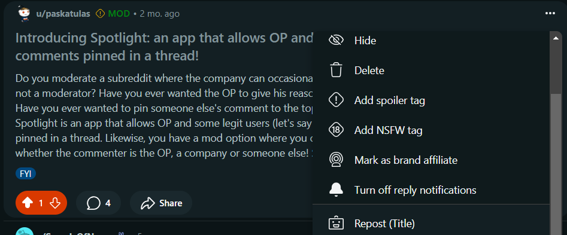
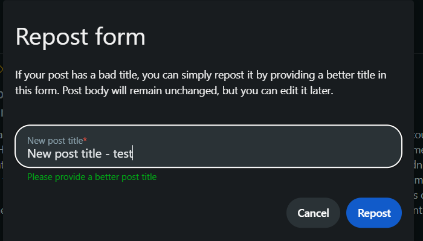
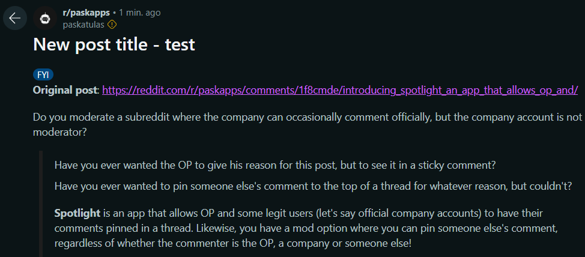

**TitleTweaker** is an intuitive tool which allows your users to easily refine their post titles easily.

Users can submit their revised title through a simple form, and the bot reposts it for them.

**Instructions**:

* 

* 

* 

If you have any questions, suggestions or complaints, feel free to reach me [here](https://reddit.com/message/compose?to=/r/paskapps&subject=TitleTweaker%20-%20Feedback&message=Text%3A%20).
